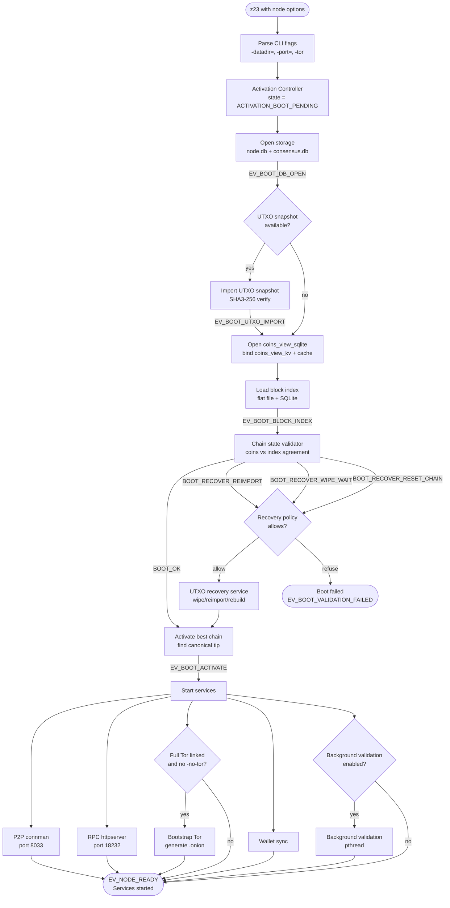
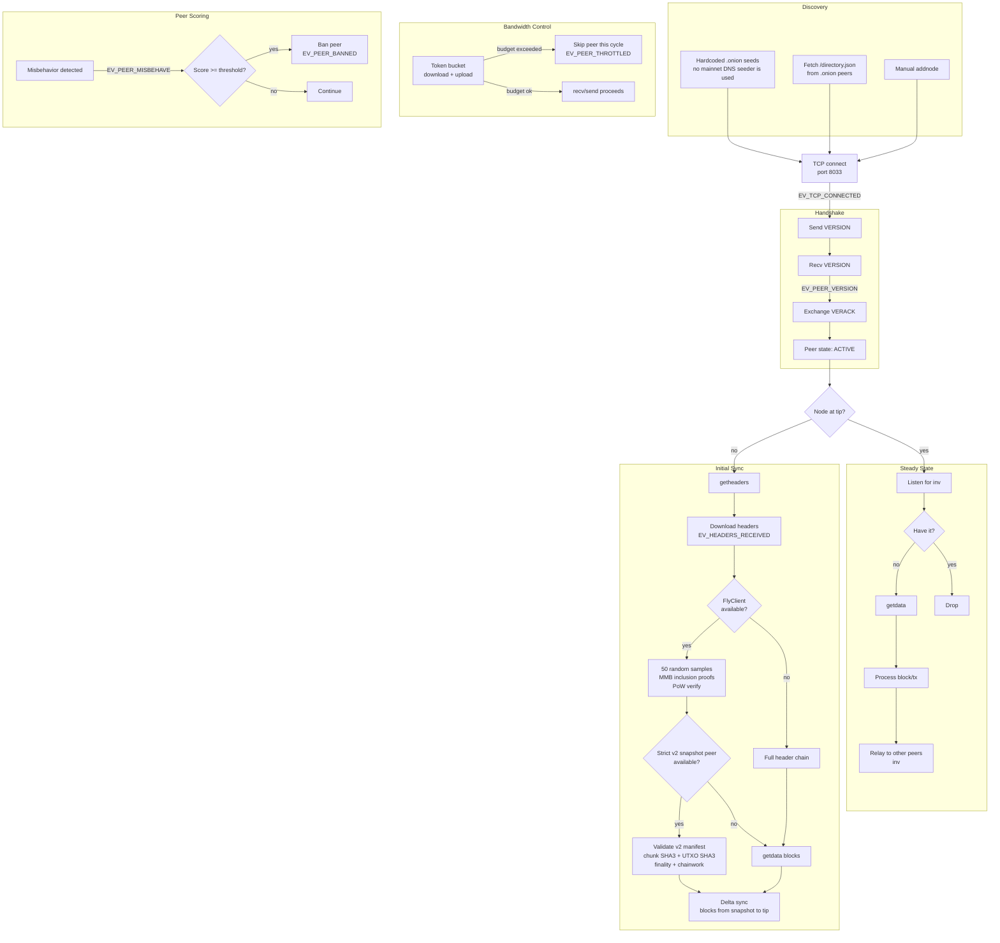
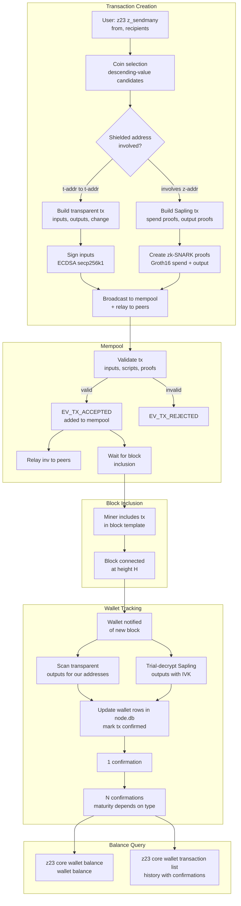
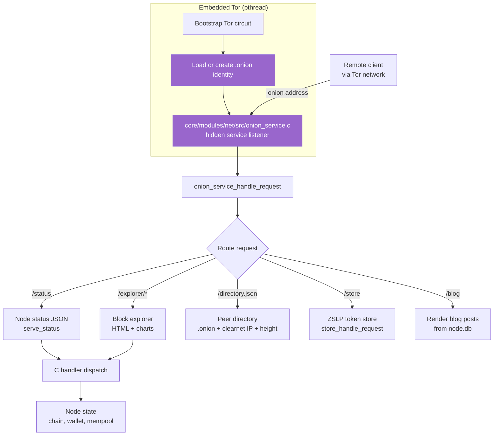

<!-- Copyright 2026 Rhett Creighton. Licensed under Apache-2.0. -->

# Z23 Architecture Diagrams

Use this page to trace startup, peer communication, block validation, and
transactions (transfers of value). A **wallet** holds keys and tracks payments;
**HTTP** (Hypertext Transfer Protocol) carries the web requests shown below.
You need the source checkout to follow the symbols and a Mermaid-compatible
viewer to render the diagrams. For a first node build, read
[GETTING_STARTED.md](./GETTING_STARTED.md).

1. Render a diagram in your Mermaid-compatible viewer.
2. Follow its arrows through the named functions, stages, and events.
3. Read the owning source before treating a branch as an operating procedure.

These are subsystem sketches; an arrow groups related work rather than
promising that every startup or synchronization path takes that branch.

| Reference | Use it for |
| --- | --- |
| This page | Current subsystem flow and source entry points |
| [FRAMEWORK.md](./FRAMEWORK.md) | Canonical architecture and current/target status |
| [Sovereignty ADR](./adr/0001-personal-sovereignty-stack.md) | Architecture rationale |

In the diagrams, `EV_*` names are observable events, not commands. A
**reducer** advances chain state through stages; a **tip** is the end of the
active chain. A **datadir** is the node's data directory. SQLite is the
embedded database used by the node; a coins **view** supplies reads and a
**cache** keeps coins in memory. **UTXO** means unspent transaction output.
A **snapshot** saves state for later import.

---

## Boot Sequence

**CLI** means command-line interface. **P2P** means peer-to-peer networking;
**RPC** means remote procedure call, served over HTTP. **Tor** carries onion
services, addressed by `.onion` names. `pthread` denotes a native thread.
The **activation controller** coordinates chain activation; `connman`
manages peer connections.
**SHA3-256** is the hash used to check snapshot bytes. Ports below are
defaults; `-port=` and `-rpcport=` override them. A full-Tor build starts Tor
by default without `-tor`. `-no-tor` disables it on non-serving lanes; network-
serving lanes refuse that option. A stub-Tor build refuses `-tor` unless the
non-serving development lane uses `-allow-tor-stub-dev`, which does not run Tor.
Startup opens `coins_view_sqlite` on the shared `node.db` connection, then
binds `coins_view_kv` as the read view beneath the coins cache, backed by
`coins_kv` in `progress.kv`.

---

## P2P Network Flow

**VERSION/VERACK** exchange protocol information and acknowledge the peer.
**Headers** hold block metadata; full blocks also contain transactions.
**DNS** (Domain Name System) resolves hostnames; **IP** (Internet Protocol)
addresses locate peers. **Mainnet** is the public chain, rather than testnet.
`getheaders`, `getdata`, and `inv` are wire messages requesting headers,
requesting objects, and announcing objects. **FlyClient** checks sampled
headers using **MMB** (Merkle Mountain Belt) inclusion proofs and **PoW**
(proof of work). A snapshot **manifest** describes transferred chunks;
**chainwork** measures accumulated work, and **finality** constrains snapshot
height. **Delta sync** downloads blocks after the snapshot. **Relay** forwards
announcements; a **token bucket** meters bytes. Ban scores use a configurable
threshold, whose default is 100.

---

## Block Validation Pipeline

**Merkle root** is the block's commitment to its transactions. Transparent
**scripts** authorize spends with **ECDSA** signatures on secp256k1.
**Sapling** and **Sprout** are shielded transaction systems; **Groth16** is
the Sapling proof system. The **turnstile** checks shielded pool balances.
A **reorganization** switches to a winning branch by unwinding old changes;
a **side chain** is a branch outside the active chain. A **checkpoint**
compares state with a compiled commitment. A **flush**
persists cached changes. The staged reducer path and the `connect_block`
detail below are conceptual views, not two successive validation passes.

```mermaid
flowchart TD
    RECEIVE[Block received<br/>from P2P or RPC] --> INGEST[reducer_ingest_block]

    INGEST --> CHECK_BLOCK[check_block<br/>structure validation]

    subgraph Structural["Structure Checks"]
        CHECK_BLOCK --> HEADER_CHECK[Header validation<br/>PoW, timestamp, difficulty]
        HEADER_CHECK --> MERKLE[Merkle root<br/>verify]
        MERKLE --> TX_BASIC[Transaction structure<br/>version, size, format]
    end

    TX_BASIC -->|EV_BLOCK_CHECK_PASSED| HEADER_ADMIT[header_admit stage<br/>candidate fact]

    HEADER_ADMIT --> VALIDATE_HEADERS[validate_headers stage<br/>contextual header checks]
    VALIDATE_HEADERS --> BODY_FETCH[body_fetch stage<br/>request missing bodies]
    BODY_FETCH --> BODY_PERSIST[body_persist stage<br/>store block bytes]
    BODY_PERSIST --> SCRIPT_VALIDATE[script_validate stage<br/>transparent scripts]
    SCRIPT_VALIDATE --> PROOF_VALIDATE[proof_validate stage<br/>shielded proofs]
    PROOF_VALIDATE --> UTXO_APPLY[utxo_apply stage<br/>same-txn UTXO delta]
    UTXO_APPLY --> TIP_FINALIZE[tip_finalize stage<br/>publish reducer tip]

    TIP_FINALIZE --> BEST_CHECK{New block extends<br/>best chain?}
    BEST_CHECK -->|no, but more work| REORG
    BEST_CHECK -->|no| DONE_SIDE([Stored as<br/>side chain])
    BEST_CHECK -->|yes| CONNECT

    subgraph Reorg["Reorganization"]
        REORG[EV_REORG_START] --> UNWIND[Reducer unwind<br/>inverse UTXO deltas]
        UNWIND -->|fail| REORG_FAIL([typed blocker<br/>manual intervention])
        UNWIND -->|ok| RECONNECT[Apply winning branch<br/>from fork point]
    end

    RECONNECT --> CONNECT

    subgraph Connection["connect_block"]
        CONNECT[EV_BLOCK_CONNECT_START] --> INPUTS[Check inputs exist<br/>in UTXO set]
        INPUTS -->|EV_TX_INPUTS_CHECKED| SCRIPTS[Verify scripts<br/>ECDSA secp256k1]
        SCRIPTS -->|EV_SCRIPT_VERIFIED| SAPLING{Sapling<br/>txs?}
        SAPLING -->|yes| GROTH16[Verify Groth16<br/>spend + output proofs]
        SAPLING -->|no| TURNSTILE
        GROTH16 --> TURNSTILE[Turnstile check<br/>sprout + sapling pools]
        TURNSTILE -->|EV_TURNSTILE_CHECK| UTXO_UPDATE[Update UTXO set<br/>spend inputs, create outputs]
        UTXO_UPDATE --> CHECKPOINT{UTXO checkpoint<br/>height?}
        CHECKPOINT -->|yes| VERIFY_CP[Verify UTXO commitment<br/>against hardcoded hash]
        CHECKPOINT -->|no| FLUSH_CHECK
        VERIFY_CP -->|pass| FLUSH_CHECK
        VERIFY_CP -->|fail| REJECT([EV_UTXO_CHECKPOINT_FAIL<br/>block rejected])
    end

    FLUSH_CHECK{Flush needed?} -->|yes| FLUSH[Flush coins to SQLite<br/>EV_COINS_FLUSH]
    FLUSH_CHECK -->|no| TIP_UPDATE
    FLUSH --> TIP_UPDATE

    TIP_UPDATE[Publish reducer tip<br/>EV_TIP_UPDATED] --> NOTIFY[Notify wallet,<br/>mempool, subscribers]
    NOTIFY -->|EV_BLOCK_CONNECT_DONE| DONE([Block connected])

    CHECK_BLOCK -->|fail| REJECT_BLOCK([EV_BLOCK_REJECTED<br/>dos score assigned])
```

---

## Wallet Transaction Lifecycle

The **mempool** holds accepted transactions awaiting a block. **Coin
selection** chooses inputs; a **t-address** is transparent and a **z-address**
is shielded. A **zk-SNARK** is a shielded proof, and an **IVK** (incoming
viewing key) allows trial decryption of received notes. **Confirmation**
count tracks block inclusion; **maturity** controls when an output can be
spent. `z_sendmany` is an RPC method, called as `z23 z_sendmany ...`.

---

## Onion Service Architecture

The **hidden service listener** accepts HTTP requests arriving through Tor.
Handlers dispatch through C calls; the explorer returns **HTML** (web page
markup), while status and directory endpoints return **JSON** (structured
data). **ZSLP** is the token protocol used by
the store. These are selected routes; the app mounts are registered in
`core/modules/net/include/net/site_routes.def`.
The `/blog` mount renders post and index HTML from `node.db`. If its handler
returns no response, the onion dispatcher sends HTTP 503; it does not serve
HTML files from `{datadir}/blog/` as a fallback.

